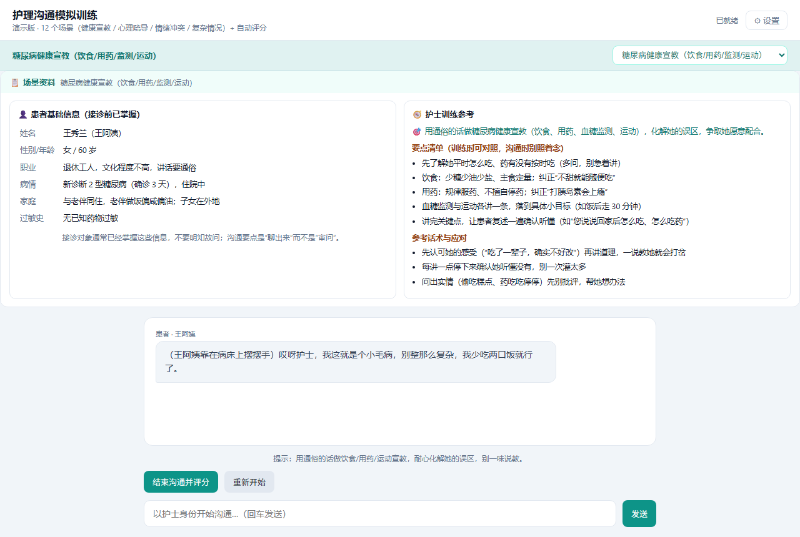

# 护理沟通模拟训练 · 对话式虚拟患者

> 面向护理 / 医学生的**护患沟通训练工具**：AI 扮演患者或家属，学生以护士身份沟通，结束后由 AI 按四个维度自动评分并给出依据。
> 12 个场景覆盖健康宣教、心理疏导、情绪与冲突、复杂情况四类。零依赖、零构建。

**这不是诊断工具**，仅用于沟通技能训练，不提供真实医疗诊断或治疗建议。



---

## 它解决什么问题

护理沟通训练的传统做法是同学互演或老师扮演，问题很实在：

- **陪练不够**：一个老师对几十个学生，一人一学期演不了几次；
- **没法反复练**：情绪激动家属、临终哀伤辅导这类场景，同学不好意思演、演了也不好意思重来；
- **反馈靠印象**：老师说"你刚才共情不够"，学生知道结论但不知道具体哪一句该改。

这个工具把"陪练"和"反馈"拆开交给 AI：

| 环节 | 做法 |
|---|---|
| 陪练 | 每个场景有独立的患者人设（病情、隐藏信息、情绪状态、说话习惯），对话里会犹豫、叹气、答非所问，被问急了会不耐烦 |
| 信息一致 | 患者档案（姓名/年龄/病情/过敏史）会拼进 system 提示，避免多轮对话后"前后矛盾、随口编造" |
| 反馈 | 结束后按场景专属量表评分：4 个维度 × 0–5 分 → 百分制，每个维度必须给出**对话原文摘录**作为依据 |
| 参照 | 场景资料栏给学生"要点清单"和"参考话术"，但明确提示"沟通时别照着念" |

## 功能

- **12 个场景**，按四类分组：健康宣教 3 个（糖尿病 / 高血压 / 冠心病术后）、心理疏导 3 个（乳腺癌术后 / 临终家属哀伤 / 产后焦虑）、情绪与冲突 3 个（情绪激动家属 / 投诉处理 / 拒绝治疗）、复杂情况 3 个（宣教中情绪崩溃 / 家属闯入质疑 / 多问题叠加）
- **场景资料栏**：患者基础信息卡（接诊前已掌握，避免"明知故问"）+ 护士训练参考（任务、要点清单、参考话术）
- **对话式训练**：回车发送，患者按人设回应，支持任意多轮
- **自动评分**：四维度量表 → 百分制总分（由维度分换算，禁止凭空给分），附「遗漏的要点 / 做得好的地方 / 改进建议」
- **可换模型**：任何兼容 OpenAI 接口的服务都能用（DeepSeek / 通义 / Kimi / 本地 Ollama）

## 怎么运行

### 方式一：本地服务（推荐）

```bash
node server.js          # 或双击 启动.bat
# 浏览器打开 http://localhost:3000
```

然后点右上角「⚙ 设置」，填入 API Key：

1. 到 [platform.deepseek.com](https://platform.deepseek.com) 注册（充值 10 元足够测试）；
2. 创建 API Key，粘贴进设置面板，点「保存」。

**为什么要跑本地服务**：它同时做了静态托管和 API 转发——
浏览器直连模型服务商会遇到跨域限制，由本地服务转发可以绕开；
另外这样 API Key 不会出现在浏览器的网络请求头里。

### 方式二：纯静态部署（GitHub Pages / Netlify）

`index.html` + `js/` + `styles.css` 就是全部，直接当静态站点发布即可。
此时没有 `/api/chat` 转发，前端会自动改为**直连**模型服务商的 OpenAI 兼容接口。

> 部署版注意事项：API Key 只在使用者自己的浏览器里（localStorage），不上传任何第三方；
> 每个人的 Key 由各自填写，站点本身不需要也不应该内置 Key。

## 工程结构

```
.
├─ index.html          页面骨架（无内联脚本、无内联样式）
├─ styles.css          样式
├─ server.js           零依赖本地服务：静态托管 + 转发模型接口（绕开跨域、隐藏 Key）
├─ js/
│  ├─ scenarios.js     12 个场景的数据（人设 / 档案 / 开场白 / 评分量表）
│  ├─ core.js          纯逻辑：拼提示词、解析模型输出、换算总分、场景自检
│  ├─ ui.js            渲染层：对话气泡、场景资料表、评分面板（只用 createElement，不拼 innerHTML）
│  └─ boot.js          装配：状态、事件委托、网络调用、启动自检
└─ test/
   ├─ core.test.js     核心逻辑测试（24 条，纯断言、不碰 DOM）
   └─ boot.test.js     启动冒烟与接线回归（25 条，用假 DOM 真跑一遍启动）
```

### 三个刻意的设计

1. **纯逻辑单独一层（`js/core.js`）**：评分链路出问题时**不报错、只静默出错**——
   JSON 解析失败就整段显示原文、缺一个维度分总分就算错、字段名换个写法全变成「—」。
   这些函数不碰 DOM、不碰网络，所以能在 Node 里逐条断言。
2. **事件委托替代行内 onclick**：原版靠 `onclick="send()"` 调全局函数，
   逻辑一收进模块就会全部失效；现在统一是 `data-action` 属性 + 一个 document 级监听器，
   想知道"点这个按钮会怎样"只看 `handleAction` 的分支。
3. **渲染只用 `createElement` + `textContent`**：对话内容与评分说明都来自模型输出，
   拼字符串进 `innerHTML` 就有注入风险。

## 测试

```bash
node --test              # 全部 49 条（零依赖，用 Node 18 起内置的 node:test）
node test/core.test.js   # 只看核心逻辑（24 条）
node test/boot.test.js   # 只看启动冒烟与接线（25 条）
```

> 用**不带参数**的 `node --test`，它会自己发现 `test/` 下的用例。
> 写成 `node --test test/` 在 Node 20 上能跑，但 **Node 22 起会把 `test/` 当成要执行的模块**，
> 直接 `Cannot find module` 退出——这个坑是 CI 在 Node 22 / 24 上先抓到的。

CI：`.github/workflows/test.yml` 会在每次 push / PR 时，用 Node 20、22、24 各跑一遍
语法检查与上面全部用例——改坏哪一条，提交时就红，不用等人想起来再跑。

**核心逻辑（`test/core.test.js`，24 条）** 覆盖：对话记录拼装、评分前置条件、
提示词组装顺序（角色 → 档案 → 通用规则）、
JSON 解析容错（裸对象 / 代码块包裹 / 前后带解释 / 完全解析不了）、
维度分归一化（0 分是有效分、越界与非数字视为无分）、
总分换算（平均分 × 20 四舍五入、缺维度时不给总分）、
结果归一化（中英文字段名兼容、字符串自动转列表、总分以维度分为准而不是模型自报）、
以及 12 个场景的结构自检。

**启动冒烟与接线（`test/boot.test.js`，25 条）** 在没有浏览器的环境里用最小假 DOM 真跑一遍启动流程：

- 4 个脚本依次执行完不抛错（白屏类问题会被这条直接抓住，并指出是哪个文件）；
- 场景下拉框按分类生成，开场白、患者信息卡与训练参考都真的渲染出了内容；
- 发送时带着 system 提示词（含患者档案与铁规则）、空消息不发请求、
  接口报错显示在对话里而不是静默失败、没填 Key 时明确提示；
- 评分能渲染出总分与四个维度、代码块包裹的 JSON 能解析、第一次不是合法 JSON 会自动重试一次、
  两次都解析不了就原样显示模型输出、模型输出里的 HTML 只当文本；
- 切换场景会重置对话、非法下标退回第一个场景不白屏；
- 本地存储不可用时只提示、不把界面卡死；
- 接线回归：页面没有行内 `onclick`、每个 `data-action` 都有分发分支、
  代码引用的每个 `#id` 都存在于 `index.html`、脚本加载顺序符合依赖、`innerHTML` 只用来清空。

> 写这套脚手架时踩到的两个坑也记在这里，免得后人重复踩：
> 假 DOM 的 `innerHTML = ''` 必须真的清空子节点，否则「切换场景后对话没清空」是假报警；
> 自定义 `fetch` 实现也必须被记录，「对话 1 次 + 评分 2 次」这类断言才不会永远读到 0。

## 加一个新场景

在 `js/scenarios.js` 的 `SCENARIOS` 数组里追加一个对象即可（下拉框会自动生成分类分组）：

```js
{
  id: '唯一英文id',
  category: '健康宣教',        // 决定它出现在哪个分类下
  title: '场景名',
  label: '患者 · 某某',        // 气泡上的显示名
  patientInfo: [               // 患者基础信息卡（显示给护士 + 喂给 AI 保证口径一致）
    ['姓名', '某某'],
    ['性别/年龄', '女 / 60 岁'],
    ['病情', '……'],
  ],
  nurseRef: {                  // 护士训练参考（只显示给护士）
    task: '本次沟通任务一句话',
    focus: ['要点1', '要点2'],  // 训练时对照的清单
    tips: ['参考话术/应对1'],
  },
  hint: '给护士的操作提示',
  opening: '开场第一句话',
  system: '角色设定（人设 + 隐藏信息 + 铁规则）',
  scoring: '评分量表（4 维度 + JSON 输出格式说明）',
}
```

加完跑一次自检即可确认结构完整：

```bash
node -e "const c=require('./js/core.js'),s=require('./js/scenarios.js');console.log(c.validateScenarios(s))"
```

## 换成其他模型

页面「⚙ 设置」里改两项即可（兼容 OpenAI 接口的都行）：

| 模型 | Base URL | Model |
| --- | --- | --- |
| DeepSeek（默认） | `https://api.deepseek.com` | `deepseek-chat` |
| 通义千问 | `https://dashscope.aliyuncs.com/compatible-mode/v1` | `qwen-plus` |
| Kimi | `https://api.moonshot.cn/v1` | `moonshot-v1-8k` |
| 本地 Ollama | `http://localhost:11434/v1` | 你部署的模型名 |

> 用本地 Ollama 时需在 Ollama 里允许跨域（设置 `OLLAMA_ORIGINS=*`），API Key 随便填一个非空字符串。

## 已知问题与后续计划

- **一个场景的评分量表键名可读性差**：量表 JSON 里的维度键名被写成了一整句话
  （如 `"总分 = 四个维度换算为百分制后汇总"`）。
  它不影响运行——模型照样按这个键返回、界面照样显示——但维度名读起来很别扭，
  手工扩量表时也容易看错层级。修法是把量表结构拆成
  `{ dimensions: [{ key: '共情', 锚点: [...], 权重: 1 }], total: '平均分 × 20' }`，
  再由 `core.buildScoringSystem()` 拼成提示词。改动要重跑全部 12 个场景的验证，所以独立进行。
- **无真实对话冒烟记录**：目前做过两层验证——语法与 HTTP 层（`node --check`、路由 200/404、缺少 Key 时返回 400），
  以及浏览器层交互（真实 Chromium 无头环境下：首屏渲染出场景/患者信息卡/开场白，
  点「发送」会把「没填 Key」的提示显示在对话区而不是静默失败，点「保存设置」状态条有反馈且真的写入 localStorage，
  切换场景会重置对话；全程控制台无报错）。
  「患者像不像、评分认不认」需要真实 API Key 跑一轮确认，尚无记录。
- **单机训练定位**：明确不做教师端、成绩管理、多人联机、语音对话、评分信度研究。
  需要「独立安装包」或「内网 / 数据不出院」时再分别走打包与本地模型方案。

## 许可

MIT
